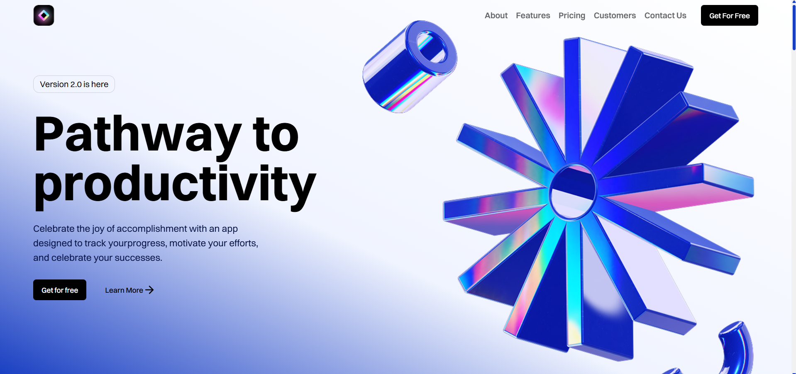

# SaaS Landing Page



## ✨ Overview
A modern **SaaS landing page** built with **React.js**, **Tailwind CSS**, and **Framer Motion**.  
The main focus of this project is to demonstrate **smooth and engaging animations** that create a lively user experience.

## 🚀 Features
- ⚡ **Framer Motion Animations** – interactive, smooth transitions and element reveals.  
- 🎨 **Tailwind CSS** – responsive design with clean and modern UI.  
- ⚛️ **React.js** – reusable components and scalable architecture.  
- 📱 **Fully Responsive** – optimized for desktop, tablet, and mobile.

## 🛠️ Tech Stack
- **React.js**
- **Tailwind CSS**
- **Framer Motion**
- **JavaScript (ES6+)**

## 📂 Project Structure
```
src/
├─ components/
├─ pages/
├─ assets/
└─ App.jsx
```

## 📸 Screenshot
The image above showcases the hero section with the main animated elements.

## 🧩 How to Run Locally
```bash
git clone <repository-url>
cd <project-folder>
npm install
npm start
```

Then open [http://localhost:3000](http://localhost:3000) in your browser.

> The animations are the heart of this project, built entirely with **Framer Motion** for a smooth and delightful user experience.
